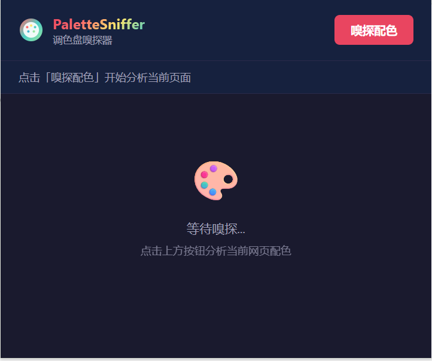
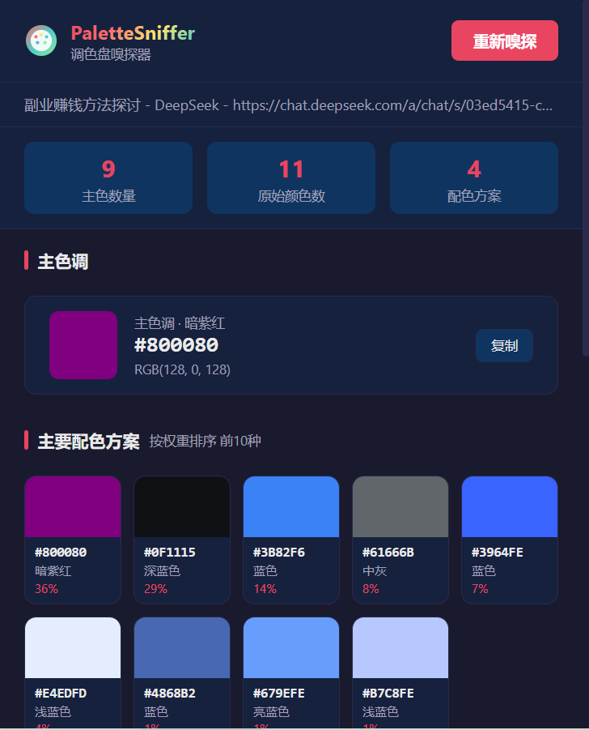
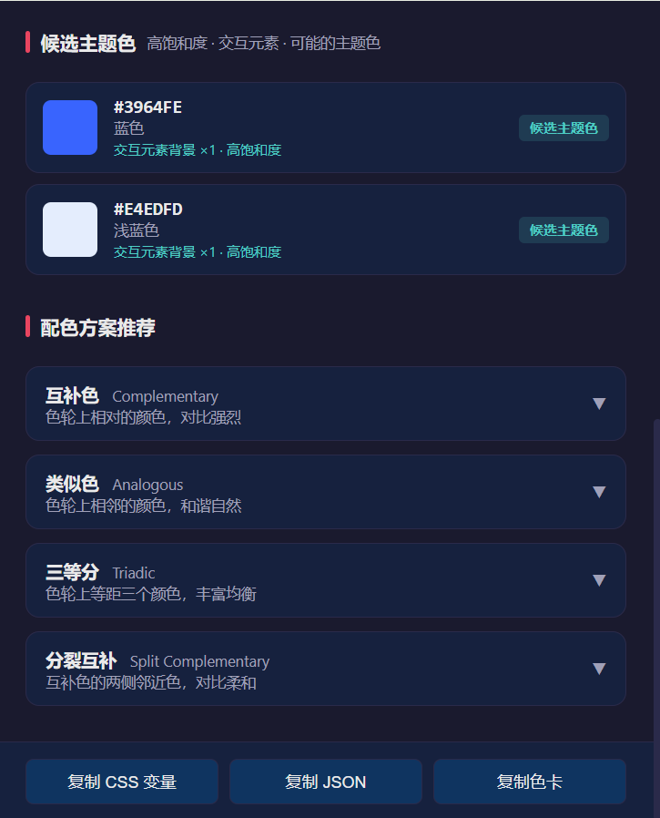

# PaletteSniffer - 调色盘嗅探器

一款智能网页配色分析工具，自动提取网页主色调并生成专业配色方案。

## 📸 效果展示

<p align="center">
  
  
  
</p>

## ✨ 核心功能

- 🎨 **智能主色识别** - 基于 LAB 色彩空间和多维加权算法，精准识别网页主题色
- 🔍 **候选主题色推荐** - 自动检测高饱和度交互元素配色
- 📊 **10种主要配色** - 按权重排序展示页面核心配色方案
- 🎯 **4种配色方案** - 互补色、类似色、三等分、分裂互补
- 💾 **一键导出** - 支持导出 CSS 变量、JSON 数据、SVG 色卡

## 🚀 核心算法

1. **元素类型加权** - 交互元素×5.0, 图标×4.0, 标题×3.0, 背景×2.0
2. **面积加权** - 结合元素可视面积动态调整权重
3. **位置加权** - 首屏元素权重更高（1.5x → 0.7x）
4. **LAB 色彩空间聚类** - ΔE<10 粗聚类，ΔE<15 细聚类
5. **CSS 变量识别** - 自动提取并解析 CSS 自定义属性

## 📦 安装使用

### 从 Chrome Web Store 安装（推荐）
即将上线...

### 从源码安装
1. 下载本项目
2. 打开 Chrome 浏览器，访问 `chrome://extensions/`
3. 开启右上角"开发者模式"
4. 点击"加载已解压的扩展程序"
5. 选择项目文件夹

### 使用方法
1. 访问任意网页
2. 点击浏览器工具栏中的扩展图标
3. 点击"嗅探配色"按钮
4. 查看分析结果并导出

## 🔧 开发与打包

### 打包扩展

#### Windows 系统
```bash
# 双击运行或在命令行执行
package.bat
```

#### macOS/Linux 系统
```bash
# 添加执行权限（首次）
chmod +x package.sh

# 运行打包脚本
./package.sh
```

打包完成后会生成 `palette-sniffer-v1.0.0.zip` 文件，可直接上传到 Chrome Web Store。

### 发布到 Chrome Web Store

详细发布指南请查看：
- [PUBLISH_GUIDE.md](PUBLISH_GUIDE.md) - 完整发布流程
- [PRE_PUBLISH_CHECKLIST.md](PRE_PUBLISH_CHECKLIST.md) - 发布前检查清单

**快速步骤：**
1. 访问 [Chrome Web Store Developer Dashboard](https://chrome.google.com/webstore/devconsole)
2. 支付 $5 注册费（首次）
3. 上传打包好的 ZIP 文件
4. 填写商店信息和截图
5. 提交审核（1-3 个工作日）

## 🎯 适用场景

- 🎨 设计师提取网站配色灵感
- 💻 前端开发快速获取页面色值
- 📱 UI/UX 分析竞品配色方案
- 🖼️ 品牌设计师研究色彩搭配

## 🛠️ 技术栈

- Manifest V3
- Vanilla JavaScript
- LAB 色彩空间算法
- TreeWalker API 性能优化

## 📄 开源协议

MIT License

## 🤝 贡献

欢迎提交 Issue 和 Pull Request！

## 📧 联系方式

- GitHub: [https://github.com/undefined-zzk/PaletteSniffer]
- Email: [2143511430@qq.com]
